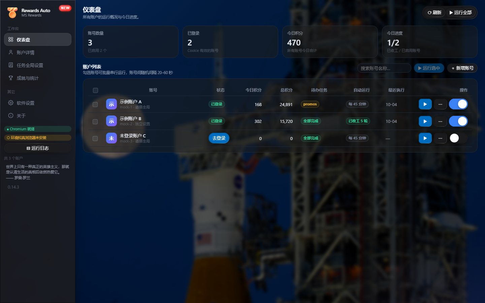
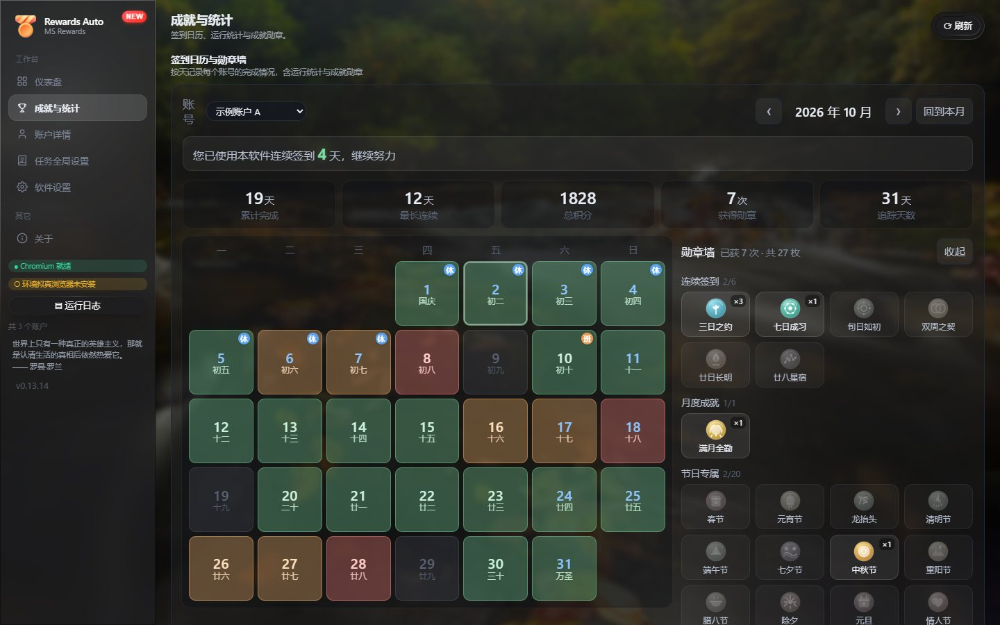
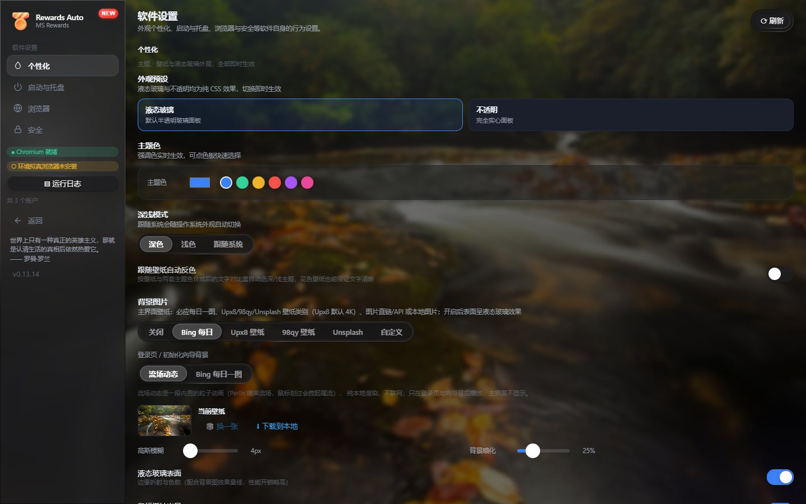
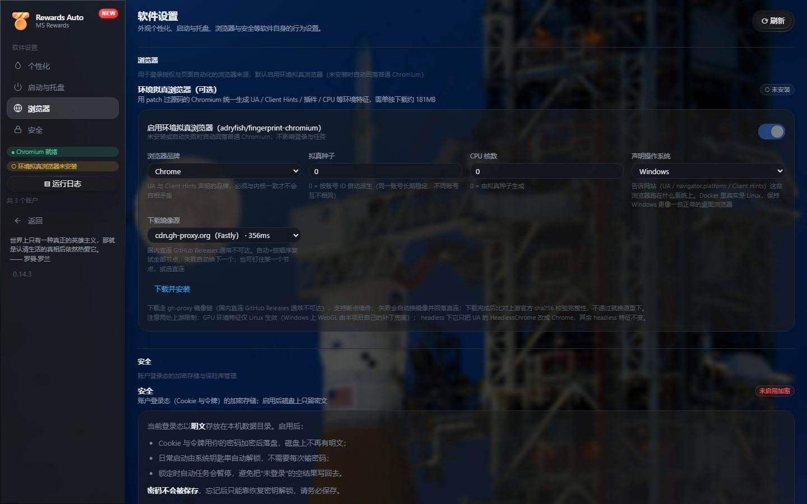

<div align="center">

# MS Rewards Auto

**独立于油猴插件的 MS Rewards（MS 积分）多账户自动任务软件**

[](https://github.com/zefeng1236/ms-rewards-auto/actions/workflows/ci.yml)
[](https://github.com/zefeng1236/ms-rewards-auto/releases)
[](https://github.com/zefeng1236/ms-rewards-auto)
[](LICENSE)

**当前版本：V0.14.10（正式版）** · [下载安装包](https://github.com/zefeng1236/ms-rewards-auto/releases) · [Docker 部署](docker/README.md) · [完整更新日志](CHANGELOG.md)

基于 Electron 44 + Playwright，提供多账户隔离、环境拟真浏览器、液态玻璃图形界面与定时自动运行；同时提供 **Docker / Web 版**（kasmVNC 图形栈 + HTTPS + Passkey），可在无桌面环境的服务器上运行。

</div>

> ⚠️ 本软件为个人学习交流用途的开源工具，**非 MS 官方授权产品**，与 Microsoft Corporation 无任何关联。使用产生的风险请阅读文末[免责声明](#免责声明)。
>
> ⚠️ 本软件完全使用 Vibe Coding 开发，所有代码均为 AI 自动生成，如果发现问题请提交 Issue。

---

## ✨ 核心特性

| | 特性 | 说明 |
|---|---|---|
| 🧬 | **环境拟真浏览器** | 双内核可自选（[Chromix 154](https://github.com/xiaozhou26/Chromix) / [fingerprint-chromium 150](https://github.com/adryfish/fingerprint-chromium)），见下方[专节](#-默认浏览器环境拟真浏览器) |
| 👥 | **多账户隔离** | 每个账户独立的 `storage/accounts/<id>/` 目录（配置、登录态、Cookie、浏览器 profile），互不干扰 |
| 🖥 | **液态玻璃 GUI** | React + TypeScript 重写的全新界面：毛玻璃质感、壁纸环境色自适应、主题色可换 |
| 🧭 | **首次启动向导** | 欢迎（多语言）→ 协议 → 风险告知 → 个性化设置，四步完成初始配置 |
| 🧩 | **三层配置模型** | 全局设置 → 账户覆盖（可选），账户可一键切换「遵循全局 / 独立设置」 |
| ⚡ | **HTTP 驱动任务** | 签入、阅读、每日活动、定期收取积分（可设「每隔 N 天」或「每天定点」）、PC/移动端搜索上报，全程 fetch 模拟，仅登录需要浏览器 |
| ⏰ | **定时自动运行** | 单次循环 / 每日定时 / 多时间段三种调度模式，可设每日开始时间与随机启动延迟 |
| 🔐 | **加密保险库** | Cookie / 令牌 scrypt + AES-256-GCM 加密存储（磁盘无明文），系统钥匙串免密解锁、恢复密钥、Passkey 登录 |
| 🎯 | **积分目标** | 按账户设置目标与自定义奖品名，达成后在仪表盘显示完成倍数 / 可兑换数量 |
| 📅 | **成就与统计** | 签到日历（农历 + 节假日 + 休班角标）、27 枚勋章、五项统计 |
| 🔔 | **推送通知** | 任务完成或受阻时推送至企业微信 / 钉钉 / 飞书 / PushMe / Bark |
| 🐳 | **Docker / Web 版** | kasmVNC 图形栈 + noVNC，HTTPS 与 Passkey，支持 Watchtower 自动更新 |

## 🧬 默认浏览器：环境拟真浏览器

本软件默认使用 **[Chromix](https://github.com/xiaozhou26/Chromix)** —— 一个 216 个 patch 的指纹一致性 Chromium，当前钉定版本 **154.0.8037.57**。canvas / WebGL / 时区语言伪装完整，实测在登录与 Bing 目标域零崩溃。

自 **0.14.6** 起支持**双内核并存**，可在「环境拟真浏览器」面板自选、分别安装与卸载：

| 内核 | 版本 | 状态 | 说明 |
|---|---|---|---|
| **[Chromix](https://github.com/xiaozhou26/Chromix)** | 154.0.8037.57 | ✅ 默认可用 | 活跃维护，实测零崩溃 |
| **[fingerprint-chromium](https://github.com/adryfish/fingerprint-chromium)** | 150.0.7871.186 | ⚠️ 可见但暂不可选 | 由 [@adryfish](https://github.com/adryfish) 维护（基于 [Ungoogled Chromium](https://github.com/ungoogled-software/ungoogled-chromium)）。存在已知崩溃缺陷，见下 |

> 💡 两个内核均由个人开发者无偿维护。如果它们对你有用，欢迎去点个 **Star** 支持上游：
> [xiaozhou26/Chromix](https://github.com/xiaozhou26/Chromix) · [adryfish/fingerprint-chromium](https://github.com/adryfish/fingerprint-chromium)

<details>
<summary><b>fingerprint-chromium 150 为何暂不可选（点开查看）</b></summary>

开启 canvas 伪装时，页面调用 `getImageData`、WebGL `readPixels` 读回像素会让渲染进程 `SIGSEGV` 崩溃（PC 固定在 `chromium+0xf2da5fb`，fault addr 是 tagged V8 heap 指针）。

崩溃有**概率性**，单次测试不作数 —— 本项目每天真实访问的目标域（登录、领取、搜索）正好落在触发路径上，会出现随机闪退。

追踪中：[adryfish/fingerprint-chromium#94](https://github.com/adryfish/fingerprint-chromium/issues/94)。上游修好后，把代码里的 `available` 置为 `true` 即可开放选择，无需其他改动。

</details>

它在本软件中是这样工作的：

| 能力 | 说明 |
|---|---|
| **指纹一致性** | UA / Client Hints / 指纹种子 / CPU 核数 / 声明的操作系统，全部由同一随机种子生成、彼此一致，不会出现「UA 说 Windows、平台接口说 Linux」的自相矛盾 |
| **与系统浏览器完全隔离** | 不继承系统 Edge / Chrome 的任何数据与特征 |
| **首次启动自动下载** | 约 202MB，多连接分片并发（4~16 线程自适应）+ GitHub hosts 优选 IP + 镜像源自动测速切换，下载完成校验官方 sha256 |
| **后台静默升级** | 新版本先下载到独立 staging 目录，等没有任务在使用旧内核时才切换，替换过程不影响正在执行的任务 |
| **内核自选与卸载** | 两个内核可分别安装、切换、卸载；默认开启「只保留单个内核」，切换时自动卸载旧的（各占约 500MB），关掉才能两个常驻随时切 |
| **普通 Chromium 回落** | 可随时在「软件设置 → 浏览器」切回 Playwright 自带 Chromium，不影响登录与任务 |

<details>
<summary><b>已知限制（点开查看）</b></summary>

- GPU 环境特征仅在 Linux 生效；Windows 上 WebGL 由本软件自己的补丁兜底
- headless 模式只把 UA 的 `HeadlessChrome` 改成 `Chrome`，其余 headless 特征不变

</details>

## 🖼 界面预览

> 壁纸为当日 Bing 每日一图，数据为演示数据。

### 仪表盘

账户总览 + 今日进度 + 账户列表（支持搜索过滤、勾选批量运行、危险操作二次确认）



### 成就与统计

签到日历、勋章墙与五项统计；节假日联网自动获取，格子按卡片宽度流式缩放



### 个性化设置

液态玻璃与透明度纯 CSS 实现、主题色、壁纸图源（Bing 每日一图 / 随机图源 / 自定义链接）、背景模糊与暗化



### 浏览器设置

环境拟真浏览器开关与指纹参数、下载镜像源、加密保险库



<details>
<summary><b>其他界面</b></summary>

- **账户详情**：账号切换 + 登录/调度状态 + 积分卡 + 本账号设置（含「遵循全局设置」开关）与积分目标磁贴
- **首次启动向导**：欢迎（选语言）→ 协议 → 风险告知 → 个性化初始设置
- **登录页**：Passkey 为主、加密密码 / 恢复密钥为备选，流场动画背景

</details>

## 🚀 快速开始

### 方式一：下载安装包（Windows 推荐）

前往 [Releases](https://github.com/zefeng1236/ms-rewards-auto/releases) 下载最新的 `MS-Rewards-Auto-Setup-<版本>.exe`，双击运行即可。

- **可自选安装目录**：非一键式安装，默认装到当前用户目录（无需管理员权限），自动创建桌面 + 开始菜单快捷方式
- **首次运行自动补全依赖**：应用启动时检测 Chromium，缺失则自动后台下载（多连接分片 + 镜像加速 + sha256 校验）
- **数据存放位置**：`%APPDATA%\ms-rewards-auto\storage\` —— 安装目录不写入任何运行时数据，卸载时账户数据**默认不删除**，重装后账户仍在

> **首次使用需要重新添加账号并登录。** 安装版与源码版的存储目录是隔离的两份数据，不会互相读取。

#### 卸载

从「设置 → 应用」或开始菜单卸载。如需彻底清理，手动删除 `%APPDATA%\ms-rewards-auto\`。

### 方式二：Docker（服务器 / NAS）

```bash
git clone https://github.com/zefeng1236/ms-rewards-auto.git
cd ms-rewards-auto/docker
docker compose up -d
```

- 内置 kasmVNC 图形栈 + noVNC（浏览器直接看到真实桌面）、HTTPS 自签证书 + Passkey、健康检查
- 默认 `:latest` 跟随 main，配合 Watchtower 自动更新；锁定版本见 [docker/README.md](docker/README.md)

### 方式三：从源码运行（开发者）

```bash
npm install        # 自动安装 Electron 与 Playwright Chromium（约 250MB）
npm start          # 或双击 start.bat
```

> 国内网络建议先设置镜像：
>
> ```powershell
> $env:ELECTRON_MIRROR="https://npmmirror.com/mirrors/electron/"
> $env:PLAYWRIGHT_DOWNLOAD_HOST="https://npmmirror.com/mirrors/playwright/"
> npm install
> ```

**使用步骤**：

1. 点击「＋ 添加」创建账户（每个账户独立登录态）
2. 选中账户 → 点击「授权登录」→ 在弹出的干净浏览器中完成 MS 登录，自动捕获授权码
3. 勾选需要的任务（签入/阅读/活动/搜索），可调整搜索间隔与词源
4. 点击「立即运行」或「运行全部账户」；可设置每日定时自动运行

## ⚙️ 配置与调度

### 三层配置模型

配置按优先级合并，下游所有调用点统一通过 `config.get()` 获取「有效配置」，无需关心来源：

```
DEFAULTS（代码内置默认值）
   ↓ 深合并
全局设置（storage/global-config.json）
   ↓ 深合并（仅当账户 useGlobal === false 时）
账户覆盖（storage/accounts/<id>/config.json）
```

- **遵循全局**（默认）：账户 `config.json` 仅含 `{ "useGlobal": true }`
- **独立设置**：关闭「遵循全局设置」后保存覆盖值，未覆盖字段回落全局
- **无损迁移**：旧版升级时自动把账户配置提升为全局设置；切回全局时覆盖值保留

### 调度模式

| 模式 | 说明 | 适用场景 |
| --- | --- | --- |
| loop | 循环运行，间隔 N 分钟，可设最大轮数与「完成即停」 | 日常挂机 |
| daily | 每日固定时间运行一次 | 定时任务 |
| windows | 多个时间段（如 09:00-12:00、14:00-23:00）轮流运行 | 精细化时段控制 |

GUI 运行期间由主进程守护（每 30 秒巡检）；Docker / 服务器场景由 Web 版调度器负责。停止指令立即生效 —— 等待中的延时与排队任务一并取消。

## 🧱 技术栈

| 层 | 技术 |
| --- | --- |
| **桌面框架** | Electron 44 · electron-builder 26（NSIS 安装包） |
| **浏览器引擎** | [Chromix](https://github.com/xiaozhou26/Chromix) 154（默认）· [fingerprint-chromium](https://github.com/adryfish/fingerprint-chromium) 150（备用，暂不可选）· playwright-core 1.45（普通 Chromium 回落） |
| **渲染层** | React 19 + TypeScript 5.9 + Vite 8 |
| **UI 组件** | [@ttqtt/liquid-glass-react](https://www.npmjs.com/package/@ttqtt/liquid-glass-react)（液态玻璃质感） |
| **样式** | CSS 设计 token + `backdrop-filter` 毛玻璃 + 壁纸环境色自适应，固定深色主题 |
| **服务端（Docker / Web 版）** | Node.js 原生 HTTP + SSE，kasmVNC / noVNC 图形栈，HTTPS + Passkey |
| **质量保障** | selfcheck 697 项自检守卫 + verify-pack 安装包核对 + TypeScript 严格模式，CI 三 job（verify / windows / docker） |

## 📦 自行打包安装程序

```bash
npm run pack        # 完整打包，产出 dist/MS-Rewards-Auto-Setup-<版本>.exe
npm run pack:dir    # 只产出 dist/win-unpacked/（免安装，调试用，快得多）
```

打包配置在 `package.json` 的 `build` 字段，几个关键点：

| 配置 | 作用 |
| --- | --- |
| `asarUnpack: playwright-core` | Playwright 要执行 Chromium 二进制，打进 asar 里会跑不起来，必须解压到 `app.asar.unpacked/` |
| `signAndEditExecutable: false` | 跳过代码签名。winCodeSign 工具包含 macOS 符号链接，Windows 普通用户没有创建符号链接的权限，会导致解压失败 |
| `nsis.oneClick: false` | 关掉一键安装，让用户能选安装目录 |
| `nsis.deleteAppDataOnUninstall: false` | 卸载保留账户数据 |

> 打包末尾如果出现清理临时文件失败的报错（`.nsis.7z` 无法删除），属于清理阶段的问题，**不影响产物** —— 检查 `dist/` 下 exe 是否已生成即可。

<details>
<summary><b>存储路径的处理（开发者向）</b></summary>

打包后 `__dirname` 指向 `app.asar/src/`，如果沿用 `path.join(__dirname, "..", "storage")` 会算到安装目录下（可能是 `Program Files`，无写权限），应用直接崩。

解决方式是 `src/storage-path.js` 统一收口所有存储路径，它读取 `process.env.MS_REWARDS_STORAGE_DIR`，缺省回落到项目根目录的 `storage/`。`electron-main.js` 在 **require 任何业务模块之前**把该变量指向 `app.getPath("userData")/storage`：

```js
// electron-main.js 顶部，必须在 require ./account 等模块之前
if (!process.env.MS_REWARDS_STORAGE_DIR && app.isPackaged) {
  process.env.MS_REWARDS_STORAGE_DIR = path.join(app.getPath("userData"), "storage");
}
```

顺序不能颠倒 —— `account.js` / `config.js` / `global-config.js` / `state.js` / `logger.js` 都在模块加载时就计算好了路径常量。

</details>

## ⌨️ CLI 备用入口

```bash
npm run cli          # 进入交互菜单
node src/main.js add "账户名"   # 添加账户
node src/main.js login 1        # 授权登录
node src/main.js run 1          # 运行账户1
node src/main.js run all        # 运行全部
node src/main.js daemon         # 定时守护
node src/main.js browser        # 检查 Chromium
```

## 🔔 推送通知

在账户的「推送通知」中填写 Webhook（企业微信 / 钉钉 / 飞书 / PushMe / Bark），留空则不推送。任务完成或受阻时会推送汇总；IP 落在非中国大陆时任务自动停止并推送当前 IP / 归属地 / 下次执行时间。

## ⚠️ 注意事项

- 运行需网络可达**项目需要访问的必要域名**（登录 / 搜索 / 区域锁定 / 兑换，单一真源见 `src/fingerprint-browser.js` 的 `REQUIRED_HOSTS` 导出）
- 建议保持默认「锁定国区」，非中国大陆 IP 会自动停止任务；判定为**多源保守取最坏**（`cn.bing.com` + `www.bing.com` 双站 + 第三方 GeoIP + 强制 ip.sb 交叉验证），任一源判境外即拦截，全部源不可用则放行
- 自动运行可设「每天开始时间」（默认 `09:00`），该时刻之前不会启动
- 搜索间隔建议 ≥ 20 秒，避免触发风控
- `storage/` 目录含账户登录态与浏览器 profile，**切勿提交到版本库**（已在 `.gitignore` 排除）

## ❓ 常见问题

| 问题 | 解决 |
| --- | --- |
| 提示浏览器未安装 | 首次启动会自动下载；也可在「软件设置 → 浏览器」手动触发，或运行 `npm run install-browser` |
| Electron 启动报 failed to install | 见上方镜像安装说明，重装 `npm install` |
| 授权登录后仍显示未登录 | 检查网络是否被代理干扰，重新点「授权登录」 |
| 修改全局设置后某些账户没生效 | 检查该账户是否关闭了「遵循全局设置」开关 |
| 从旧版升级后配置丢失 | 旧版账户配置已自动迁移：全局文件不存在时提升为全局设置 |
| 安装版看不到源码版的账号 | 两者存储目录隔离，安装版数据在 `%APPDATA%\ms-rewards-auto\storage\`，需重新添加账号 |
| 指纹浏览器下载慢 | 「软件设置 → 浏览器 → 下载镜像源」可切换自动测速 / 指定镜像，支持断点续传 |
| 打包时报 winCodeSign 符号链接失败 | 确认 `build.win.signAndEditExecutable` 为 `false`（本仓库已配置） |

## 免责声明

1. 本软件是个人开发者出于学习与技术交流目的编写的开源工具，与 Microsoft Corporation 没有任何隶属、代理、授权或合作关系。Microsoft、Bing、Microsoft Rewards 等名称与商标归其各自权利人所有，仅作描述性指代之用。
2. 使用本软件可能违反 Microsoft 服务协议中关于自动化访问的相关条款，由此可能产生账户受限、积分扣减/回收、功能禁用、触发人机验证、IP 被限制访问等后果，相关风险与损失由使用者自行承担。
3. 软件按「现状」提供，不提供任何明示或暗示的担保。作者不对因使用或无法使用本软件所导致的任何直接或间接损失（包括积分损失、账户损失、数据丢失、利润损失或业务中断）承担责任。
4. 请在使用前确认您所在地区的法律法规以及 Microsoft 服务协议允许此类自动化行为；若不允许，请立即停止使用并卸载本软件。
5. 请合理设置运行频率（搜索间隔建议 ≥ 20 秒），避免对目标服务造成负担。
6. 本软件使用纯 Vibe Coding 编写，随缘维护：不承诺更新频率、修复时限或长期维护义务，功能与兼容性可能随版本演进调整，敬请知悉。

## 许可证

MIT

> 第三方开源组件、字体与素材的许可说明见 [THIRD_PARTY_NOTICES.md](THIRD_PARTY_NOTICES.md)。
